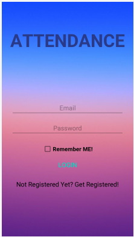
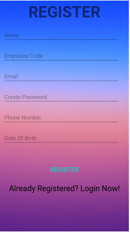

# Attendence_Login
This App was built for the purpose of recording employes attendence and monitor them.
It uses a  Google Firebase based Registration/Login Section and the Home page contains the option for marking the attendance.
The Owner can acces the List of employes present that day in the app itself, with JSON Pasrisng using Volly.
# Preview
&nbsp; &nbsp; &nbsp; &nbsp; &nbsp; &nbsp;  &nbsp; &nbsp; &nbsp; &nbsp; &nbsp; &nbsp;     &nbsp; &nbsp; &nbsp;    &nbsp; &nbsp; &nbsp;
# Discription
This Google Sheets File [Attendence Register File](Attendance%20Register.xlsx) contains the list of Employees present and is updated as the Employee presses the Mark Attendence Button. 
It contains the Name and Employee Code of the Person, which are extracted from the Firebase storage. These values are parsed through the Volly Library into the Google Sheet.
